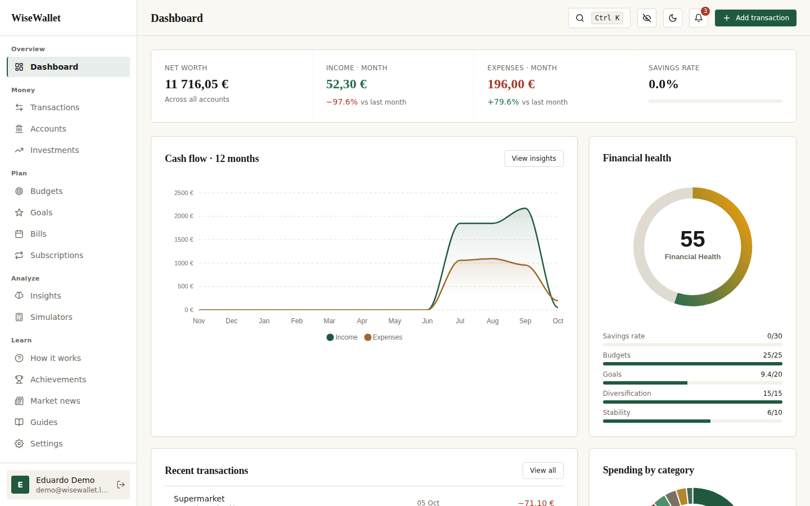
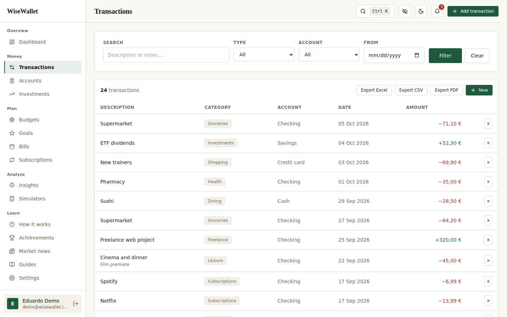
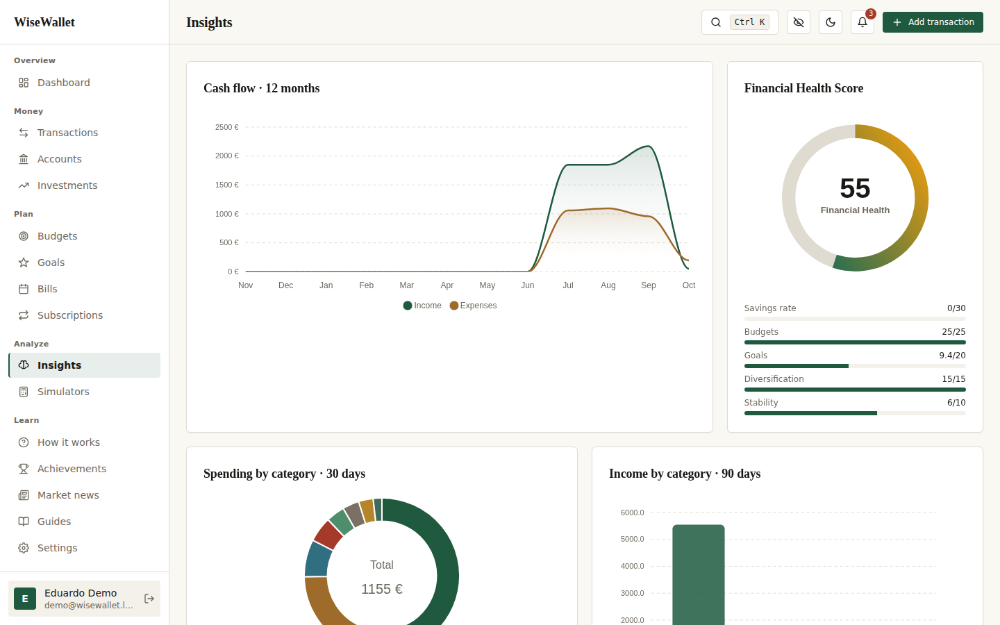
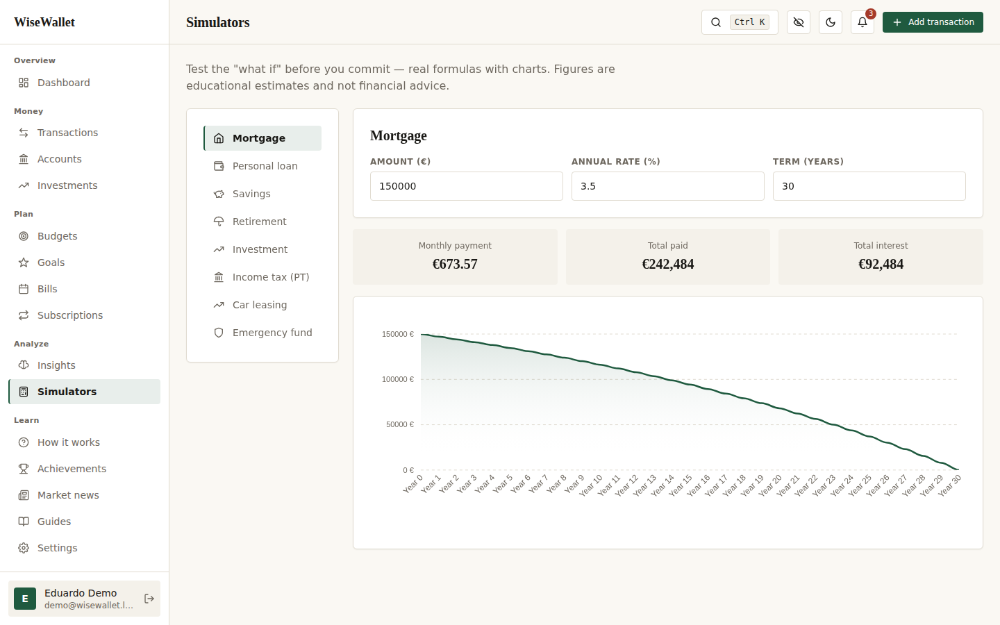
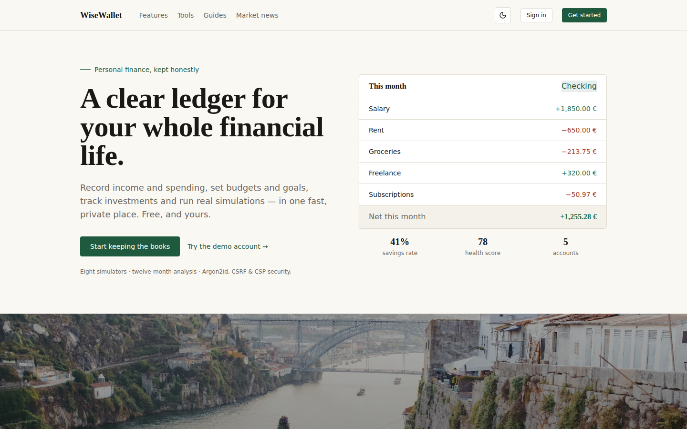
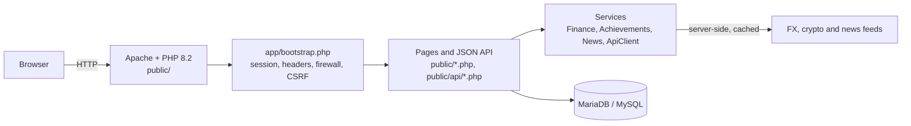

# WiseWallet

**A security-minded personal-finance web app in plain PHP: transactions, budgets, goals, investments and financial simulators, running in one click.**

[](https://github.com/EduardoRochaFernandes/wise-wallet/actions/workflows/ci.yml)
[](LICENSE)


[](https://codespaces.new/EduardoRochaFernandes/wise-wallet)



## Why this exists

WiseWallet is a **student / portfolio project**: a complete personal-finance app (record money, understand it,
plan, simulate, learn) used as a vehicle to practise **secure web development without a framework**.
Authentication, CSRF, sessions, CSP, rate limiting and access control are implemented by hand and covered by an
HTTP test-suite that runs in CI. It is not a production product and has never handled real financial data;
see [SECURITY.md](SECURITY.md) for exactly what is implemented and what is not.

## Run it in one click

**Option 1: GitHub Codespaces (nothing to install).** Click the badge above, or
*Code -> Codespaces -> Create codespace on main*. PHP, Apache and MariaDB start automatically, the schema and demo
data are imported, and the app opens in a browser tab on the forwarded port (first start takes a few minutes while the
CSS is built; if the tab does not open, use the *Ports* panel).

**Option 2: Docker Compose (one command, zero configuration).**

```bash
git clone https://github.com/EduardoRochaFernandes/wise-wallet.git
cd wise-wallet
docker compose up --build
```

Then open <http://localhost:8080>. The database is created and seeded on first start. To reset it to the seed state:
`docker compose down -v`. Optional overrides (port, DB passwords) are documented in [`.env.example`](.env.example).

### Demo login (DEMO ONLY)

| Role  | Email                    | Password               |
|-------|--------------------------|------------------------|
| Demo  | `demo@wisewallet.local`  | `Demo@WiseWallet2026`  |
| Admin | `admin@wisewallet.local` | `Admin@WiseWallet2026` |

These are throw-away accounts that exist only in the local demo database and have publicly documented passwords.
Never deploy the seed data as-is; the Compose stack binds to `127.0.0.1` for this reason.

### Without Docker

Requirements: PHP 8.0+ (`pdo_mysql`, `openssl`, `curl`, `mbstring`, `zip`), MySQL or MariaDB, Node.js 18+.

```bash
bash setup.sh        # Linux / macOS / Git Bash   (setup.bat on Windows with XAMPP)
```

This installs npm packages, builds the CSS, creates `.env` with a generated `APP_KEY`, starts MySQL where it can,
imports `database/wisewallet.sql`, and serves the app at <http://localhost:8000> with PHP's built-in server
(`scripts/router.php` supplies the clean-URL rewriting that `.htaccess` provides under Apache).
Manual equivalent: `npm install && npm run build && cp .env.example .env`, import the SQL file, then
`php -S localhost:8000 -t public scripts/router.php`.

## Screenshots

| Transactions | Analytics |
|---|---|
|  |  |

| Simulators | Landing page |
|---|---|
|  |  |

All screenshots are real captures of the Docker Compose stack with the demo seed data, produced by the
[Screenshots workflow](.github/workflows/screenshots.yml) (`scripts/screenshots.js`).

## Features

- **Transactions and accounts:** income / expense / transfer with categories, tags and notes; several account types with balances kept in sync; soft delete.
- **Planning:** category budgets with threshold alerts, goals with contributions and milestones, bill calendar, subscription tracker.
- **Investments:** stocks, ETFs, crypto, bonds and more, with gain/loss, ROI and a diversification breakdown.
- **Analytics:** twelve-month cash flow, spending by category and weekday, top expenses, and a composite Financial Health Score.
- **Simulators:** mortgage, personal loan, savings, retirement, investment growth, Portuguese income tax, leasing, emergency fund.
- **Learning and engagement:** admin-managed guides, market news from public RSS feeds, an achievement system.
- **Export:** CSV, XLSX and PDF, using small dependency-free PHP writers (`vendor/`).
- **UI:** light/dark theme, a privacy mode that masks amounts, a Ctrl+K command palette.
- **Admin panel:** users, categories, articles, settings, audit and security logs.
- **Security:** Argon2id, optional TOTP 2FA, CSRF tokens, hardened sessions, nonce-based CSP, rate limiting, ownership checks. See [SECURITY.md](SECURITY.md).

## Architecture



Every page and API endpoint starts with `app/bootstrap.php`, which loads configuration, starts a hardened session,
sends the security headers, runs the request firewall and enforces CSRF. Pages are server-rendered and enhanced with
vanilla JavaScript and ApexCharts. External data (exchange rates, crypto prices, news) is fetched server-side with
caching and fallbacks, so the CSP can stay at `connect-src 'self'`.

## Project structure

```
wise-wallet/
  app/                     Application code (not web-reachable)
    bootstrap.php            Wires config, DB, security stack, firewall, CSRF
    Security/                Session, Headers, Csrf, Auth, RateLimit, Totp, Pwned, Validator, Audit
    Services/                Finance, Firewall, Achievements, ApiClient, Cache, MarketNews, Mailer, ...
    views/partials/          Shared layout, SEO and navigation partials
  public/                  Web root (Apache DocumentRoot)
    *.php, admin/, api/      Pages, admin panel, JSON API
    assets/                  JS, images; app.css is built from src/css
  database/wisewallet.sql  Schema, indexes and DEMO seed data (imported automatically in Docker)
  docker/entrypoint.sh     Container entrypoint (generates a random APP_KEY)
  Dockerfile               Multi-stage: Node builds the CSS, then PHP + Apache
  docker-compose.yml       web + db (MariaDB, auto-seeded)
  .devcontainer/           Codespaces / dev container definition
  scripts/                 Setup helpers, php -S router, sitemap, screenshot capture
  src/css/app.css          Tailwind source and design tokens
  tests/security-checks.php  HTTP functional + security test-suite
  vendor/                  Dependency-free PDF and XLSX writers
```

## Configuration

Settings are read from `.env` (native runs) or real environment variables (Docker). See [`.env.example`](.env.example)
for every option: database, `APP_KEY`, session lifetime, login lockout, API rate limit, IP allow/deny lists,
external API URLs and the mail driver (`log` by default, so password-reset emails are written to
`storage/logs/mail.log` instead of being sent).

## Testing and CI

`tests/security-checks.php` drives a running instance over HTTP (authentication, CSRF, validation, IDOR, RBAC,
WAF rules, output escaping, CSV-injection, rate limiting and security headers). Run it against the Compose stack:

```bash
docker compose up --build -d --wait
docker compose exec -T -e WW_TEST_BASE=http://localhost web php tests/security-checks.php
```

GitHub Actions ([ci.yml](.github/workflows/ci.yml)) runs on every push and pull request:
PHP lint (8.0, 8.2, 8.4), CSS build, SQL import on MySQL 8, the Docker Compose stack with smoke tests plus the
test-suite above, and a build of the Codespaces dev container.

## Status and limitations

- Portfolio project: feature-complete for its scope, but not audited and not intended for real financial data.
- Tests are HTTP integration checks only; there are no unit tests.
- Live FX, crypto and news depend on free public APIs; the app falls back to cached or static data when they are unreachable.
- The built-in PHP server and Docker setup are for demos and development, not production.
- Known security limitations (for example, the 2FA QR code is rendered by a third-party service) are listed in [SECURITY.md](SECURITY.md).

## Contributing

See [CONTRIBUTING.md](CONTRIBUTING.md) and the [Code of Conduct](CODE_OF_CONDUCT.md). Report vulnerabilities privately as
described in [SECURITY.md](SECURITY.md).

## License

[MIT](LICENSE) (c) 2026 Eduardo Fernandes.

## Author

Eduardo Fernandes: [@EduardoRochaFernandes](https://github.com/EduardoRochaFernandes)
